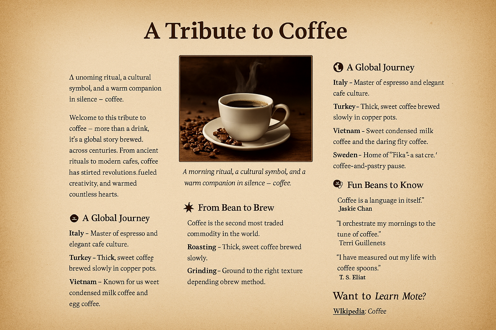

<h1 align="center">☕ A Tribute to Coffee</h1>

  
  

  Eine einfache und informative Webseite, die Kaffee gewidmet ist – mit Informationen über seine Geschichte, interessante Fakten und wie er hergestellt wird. Dieses Projekt wurde ausschließlich mit HTML und CSS erstellt und ist Teil eines Einsteiger-Webentwicklungsprojekts.

---

<h2>📸 Screenshots</h2>

  
  
  

---

<h2>✨ Funktionen</h2>

* Sauberes und responsives Design: Optimiert für Desktop und mobile Geräte.
* Informative Inhalte: Behandelt Geschichte, Zubereitungsmethoden und spannende Fakten über Kaffee.
* Strukturierte Layouts: Übersichtliche Abschnitte für einfaches Lesen.
* Einsteigerfreundlicher Code: Ideal, um HTML- und CSS-Grundlagen zu lernen
  
---

<h2>🔗 Live-Vorschau</h2>

 👉 <a href="https://amarko-med.github.io/A-Tribute-to-Coffee/" target="_blank"><strong>Hier klicken, um es live auszuprobieren</strong></a> 

---

## 🛠️ Erstellt mit

* HTML5 – Semantische Struktur der Webseite.
* CSS3 – Styling, Layouts und responsives Design
  
---

<h2>📁 Projektstruktur</h2>
<pre>
☕ Coffee-Tribute-Page/
├── index.html      ← Hauptseite
├── styles.css      ← Styles und Layout
└── images/         ← Screenshots
</pre>

---

## 📩 Kontakt

##  E-Mail: [amarkouchi5@gmail.com](mailto:amarkouchi5@gmail.com)

---

## 📝 Lizenz

MIT – Frei zur Nutzung und Anpassung.
